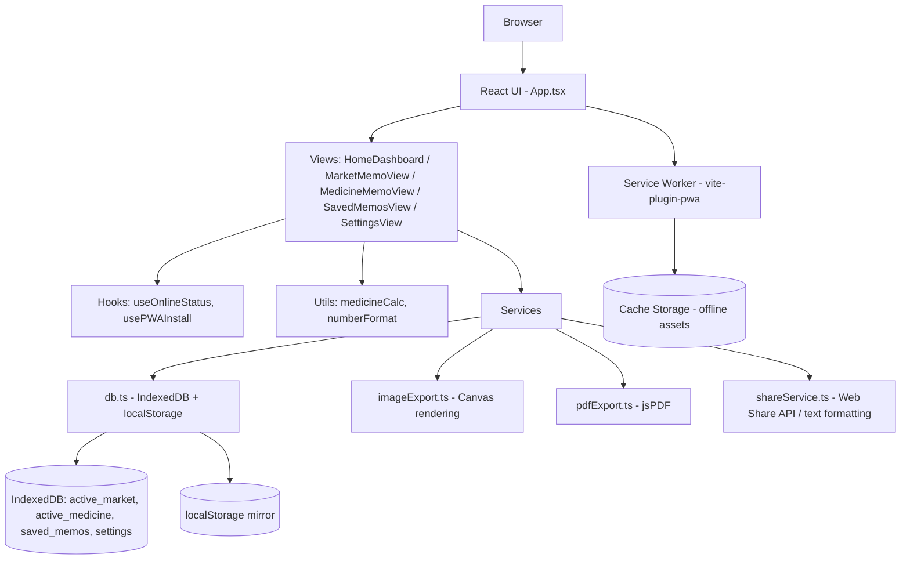

# 🧾 MY MEMO

**A local-first, offline market & medicine memo manager for Android and desktop browsers.**


MY MEMO is a Bengali-language, mobile-first web app for planning **market/shopping lists** and **medicine stock & purchase calculations**, saving them as reusable memos, and exporting them as an image, PDF, or plain text — entirely from local browser storage, with no backend or account required.

---

## 📖 Overview

Keeping a running grocery list or tracking how many pills are left in a strip is normally done on paper or in scattered chat messages. MY MEMO turns that into a small, installable, offline-capable app:

- **Market memos** — a shopping list with quantities, units, prices, and a purchased/pending state.
- **Medicine memos** — tracks current stock in strips/pieces, calculates monthly requirement, and works out exactly how much more to buy.
- **Saved memos** — every finished memo can be stored, searched, re-opened, duplicated, and shared later.
- **Local-first persistence** — everything is written to the browser's IndexedDB (with a localStorage mirror) as you type; there is no server or cloud sync.

It's aimed at anyone in a Bengali-speaking household who plans market trips or medicine refills — and at developers who want a compact reference for building an installable, local-first PWA with React, IndexedDB, and Canvas-based export.

---

## ✨ Key Features

### 🛒 Market Memo
- Add items with **name, quantity, unit** (কেজি, গ্রাম, লিটার, মিলিলিটার, পিস, প্যাকেট, বোতল, ডজন, অন্যান্য), **price per unit**, and an optional **note**.
- Mark items as **purchased / pending**, filter the list by that state.
- **Edit** or **delete** any item, and **reorder** items with dedicated up/down move controls (no drag-and-drop).
- Editable memo **title**, live **estimated total cost** (and separate purchased/pending subtotals).
- "Clear purchased" action to remove everything already checked off.
- **Save as memo** to snapshot the current list into Saved Memos.

### 💊 Medicine Memo
- Each medicine stores a **strip size** (pieces per strip), **current stock** (in strips + loose pieces), and a requirement entered either as a **daily dose** or a **monthly strip/piece total**.
- Automatic calculation (`src/utils/medicineCalc.ts`) converts everything to a common "pieces" unit and works out the shortage:

  ```text
  1 strip = 10 pieces
  Current stock: 0 strips + 2 pieces
  Monthly requirement: 1 strip + 3 pieces  → 13 pieces
  Shortage: 13 - 2 = 11 pieces  → auto-required = 1 strip + 1 piece
  ```

- The **auto-calculated purchase quantity** can be manually overridden per item; once overridden, the app keeps your manual value instead of recalculating it.
- Price can be entered **per strip or per piece**, and estimated cost is computed from the *final* purchase quantity.
- A second, simpler data shape (`RequiredMedicineItem` — name + strips/pieces + price, no stock/requirement math) also exists in the data model and is used by the pre-loaded example data and by Saved Memos/export. **Status: partially implemented** — the current "Add Medicine" form only creates the full stock-tracking type; there is no in-app screen yet to create a new simple/required-only entry from scratch.

### 📋 Saved Memos
- Every saved market or medicine memo is listed with **search** (by title) and a **filter** (all / market / medicine).
- **View**, **edit fields inline** (add/edit/delete individual items within an already-saved memo), **duplicate**, and **delete** any saved memo.
- Loading a saved memo back into the active Market or Medicine editor is supported (continue editing where you left off).
- Each memo stores its own item list, computed total price, item count, and formatted date/time.

### 💾 Local Storage
- **IndexedDB** (`MY_MEMO_LOCAL_DB`) is the primary store, with four object stores: `active_market`, `active_medicine`, `saved_memos` (indexed by timestamp and type), and `settings`.
- Every write to IndexedDB is mirrored into **`localStorage`** as a fallback that's read only if IndexedDB is empty or unavailable.
- Data is written automatically as you edit (auto-save) — there is no manual "save" step for the active market/medicine list.
- What survives: a page reload, closing and reopening the browser tab, restarting the device, and closing/reopening the installed PWA all keep your data, because it lives in the browser's/OS's persistent storage for that origin. Data is lost only if the browser's site data/storage for the app is cleared, the app's own "delete all data" option is used, or the browser is used in a private/incognito mode that discards storage on close.

### 📤 Export & Sharing
- Three export formats, generated entirely client-side:
  - **Image (PNG)** — memo rendered onto an HTML `<canvas>` (`src/services/imageExport.ts`) with a colored header, table, and totals.
  - **PDF** — the same canvas image embedded into an A4-width PDF via `jspdf` (`src/services/pdfExport.ts`).
  - **Plain text** — a formatted line-by-line summary (`formatMemoAsText` in `src/services/shareService.ts`), useful for pasting into a chat.
- Before exporting, you can choose:
  - **With price / without price** — hides all prices and the total when off.
  - For medicine memos, **Full Memo** (name, stock, requirement, quantity to buy) vs. **Simple Required** (name + quantity only).
- Sharing uses the **Web Share API** (`navigator.share` / `navigator.canShare`) so Android's system share sheet (WhatsApp, Messenger, email, etc.) can be used directly; if the Web Share API or file-sharing isn't available, the app falls back to **downloading the file** or **copying text to the clipboard**. There is no direct WhatsApp/social-platform API integration — sharing goes through the OS share sheet only.

### ⚙️ Settings
- **User name** (shown under the date on every exported memo) — default seed value is `Iftikhar Ahmed`.
- **Currency symbol** (free text, default `৳`).
- **Number format** — Bengali digits (১২৩) or Western digits (123), applied throughout the UI and exports.
- **Default share format** (image / PDF / text) used to pre-select the export option in the Share modal.
- The `UserSettings` type also defines `theme` (`light`/`dark`/`system`) and `dateFormat` fields with default values, but **no settings-screen control currently exists to change them** — they are effectively fixed at their defaults in the shipped UI.

### 🔄 Backup & Restore
- **Export backup** — downloads a single JSON file (`MY_MEMO_BACKUP_<date>.json`) containing the active market list, active medicine list, all saved memos, and settings.
- **Restore backup** — imports that JSON file back in, merging/overwriting the corresponding IndexedDB stores.
- **Delete all data** — a confirmation-gated "danger zone" action that clears every store and re-seeds the app with its built-in example data.

### 📱 PWA
- Configured via `vite-plugin-pwa` with `registerType: 'autoUpdate'` — a service worker is generated at build time and precaches app assets (`**/*.{js,css,html,ico,png,svg,woff,woff2}`) for offline use.
- Web app manifest declares standalone `display`, theme/background colors, `start_url`/`scope` of `/`, and 192px/512px + maskable icons — making the app installable ("Add to Home Screen") on Android and desktop Chromium browsers.
- A custom `usePWAInstall` hook drives an in-app **Install** button (using the `beforeinstallprompt` event) and shows an **iOS "Add to Home Screen" instructions dialog** on Safari, where the native install prompt isn't available.
- An online/offline indicator badge in the header reflects `navigator.onLine`.

---

## 🖼️ Screenshots

No screenshots currently exist in this repository — only app icons are checked in (`public/pwa-192x192.png`, `public/pwa-512x512.png`, etc.).

If you'd like to add screenshots, a clean layout for GitHub is:

```
docs/screenshots/home.png        <- Home dashboard
docs/screenshots/market.png      <- Market memo list
docs/screenshots/medicine.png    <- Medicine calculation view
docs/screenshots/share-modal.png <- Export/share options
docs/screenshots/saved.png       <- Saved memos list
```

*(These paths are placeholders — replace with real captures and reference them here once available.)*

---

## 🛠️ Technology Stack

| Technology | Purpose |
|---|---|
| [React 19](https://react.dev) | UI library |
| [TypeScript 5.8](https://www.typescriptlang.org) | Static typing across the app |
| [Vite 6](https://vitejs.dev) | Dev server & production build |
| [Tailwind CSS 4](https://tailwindcss.com) (`@tailwindcss/vite`) | Utility-first styling |
| [vite-plugin-pwa](https://vite-pwa-org.netlify.app) | Service worker + manifest generation |
| [lucide-react](https://lucide.dev) | Icon set |
| [jsPDF](https://github.com/parallax/jsPDF) | Client-side PDF generation |
| [motion](https://motion.dev) | Animation library (dependency present; used for UI transitions) |
| IndexedDB (native browser API) | Primary persistent storage |
| localStorage (native browser API) | Fallback/mirror storage |
| Canvas API (native browser API) | Renders memo images for JPG/PNG export and the PDF's embedded image |
| Web Share API (native browser API) | Android/desktop share-sheet integration |

> `@google/genai`, `express`, and `dotenv` are present in `package.json`/`.env.example` but are **not imported or used anywhere in `src/`** — they are leftovers from the project's original AI Studio scaffold and can be ignored (or removed) without affecting the app.

---

## 🏗️ Architecture



- **UI layer** (`src/components/`) — five top-level views (`HomeDashboard`, `MarketMemoView`, `MedicineMemoView`, `SavedMemosView`, `SettingsView`) plus shared chrome (`Header`, `BottomNav`) and the `ShareModal`. `App.tsx` owns all top-level state and wires views together.
- **Hooks** (`src/hooks/`) — `useOnlineStatus` (network state) and `usePWAInstall` (install prompt + iOS detection).
- **Utilities** (`src/utils/`) — `medicineCalc.ts` (strip/piece math) and `numberFormat.ts` (Bengali/English digits, currency, date/time formatting).
- **Services** (`src/services/`) — `db.ts` (storage layer), `imageExport.ts` (canvas rendering shared by image and PDF export), `pdfExport.ts` (wraps the canvas image in a PDF), `shareService.ts` (text formatting + Web Share orchestration).
- **PWA layer** — configured entirely in `vite.config.ts` via `vite-plugin-pwa`; there is no hand-written service worker file in the source tree.

---

## 🗂️ Data Model

Defined in `src/types.ts`:

- **`MarketItem`** — `id`, `name`, `quantity`, `unit`, `pricePerUnit`, `note?`, `isPurchased`, `createdAt`.
- **`MedicineItem`** — `id`, `name`, `stripSize`, `currentStockStrips`, `currentStockPieces`, `calcMethod` (`'daily' | 'monthly'`), `dailyRequirement`, `monthlyRequirementStrips`, `monthlyRequirementPieces`, `priceType` (`'strip' | 'piece' | 'none'`), `unitPrice`, `note?`, `finalPurchaseStrips`, `finalPurchasePieces`, `isPurchaseOverridden`, `createdAt`.
- **`RequiredMedicineItem`** — a simpler shape: `id`, `name`, `strips`, `pieces`, `unitPrice?`, `priceType?`, `note?`, `createdAt`. Supported by storage/export but not yet by an in-app creation form (see Medicine Memo above).
- **`SavedMemo`** — `id`, `title`, `type` (`'market' | 'medicine_full' | 'medicine_required'`), `date`, `time`, `timestamp`, `marketItems?`, `medicineItems?`, `requiredMedicineItems?`, `totalPrice`, `itemCount`, `note?`.
- **`UserSettings`** — `userName`, `currency`, `theme`, `dateFormat`, `defaultShareFormat`, `numberFormat`.
- **`ActiveMarketState` / `ActiveMedicineState`** — the in-progress (not-yet-saved) memo currently shown in the Market/Medicine tab; auto-saved to storage on every change.

No secrets, credentials, or personal data beyond what the user types (name, memo contents) appear in this model.

---

## 🚀 Installation

### Requirements
- **Node.js 18+** (required by Vite 6 / the TypeScript/ESM toolchain used here).
- npm (or another Node package manager — the repo ships a `bun.lock`, indicating [Bun](https://bun.sh) was used during development, but plain `npm install` works fine too).
- A modern Chromium-based browser (or Android Chrome) is recommended to exercise IndexedDB, the Web Share API, and PWA install prompts.

### Clone
```bash
git clone <repository-url>
cd MY-MEMO
```

### Install dependencies
```bash
npm install
```

### Development
```bash
npm run dev
```
This runs `vite --port=3000 --host=0.0.0.0`, so the app is available at **http://localhost:3000** and also on your machine's LAN address (see below).

### Build
```bash
npm run build
```
Outputs a production bundle (including the generated service worker and manifest) to `dist/`.

### Preview a production build
```bash
npm run preview
```

### Type-check
```bash
npm run lint
```
Runs `tsc --noEmit` (there is no ESLint/Prettier configuration in this repo).

---

## 📱 Android / Local Network Usage

The dev server is already configured with `--host=0.0.0.0`, so it listens on all network interfaces, not just `localhost`.

1. Run `npm run dev` on your laptop.
2. Find your laptop's LAN IP address (e.g. `192.168.1.23`) — on Windows: `ipconfig`; on macOS/Linux: `ifconfig` or `ip addr`.
3. On an Android phone connected to the **same Wi-Fi network**, open Chrome and go to:
   ```
   http://<your-laptop-LAN-IP>:3000
   ```
4. From there you can use the app normally, and Chrome will offer the **"Add to Home Screen"** / install prompt for the PWA.

If the phone can't reach the page, check that your laptop's firewall allows inbound connections on port `3000`.

---

## 🌐 Offline / Local-First Behavior

- **Works fully offline:** creating, editing, saving, deleting, and exporting/sharing memos — none of these require a network connection once the app has loaded at least once (so the service worker can cache it).
- **Requires a network connection only for:** the very first load of a not-yet-cached app shell, and the Google Fonts (`Hind Siliguri`, `Plus Jakarta Sans`) linked in `index.html`, which are fetched from `fonts.googleapis.com`/`fonts.gstatic.com` rather than bundled locally.
- **Where data lives:** exclusively in the browser's IndexedDB and localStorage for this site's origin, on the device you're using. Nothing is sent to a server — there is no backend, API, or analytics call anywhere in the source.
- **After closing the browser/PWA:** data persists; reopening the app (browser tab or installed PWA) reloads everything from IndexedDB automatically.
- **After a device restart:** data persists, since IndexedDB/localStorage are part of the browser's persistent profile storage, not memory.
- Data is lost only if you use the app's own "delete all data" option, manually clear the browser's site storage/cache for this origin, or use a private/incognito session.

---

## 🔒 Privacy & Security

- MY MEMO stores **only what you type**: market item names/quantities/prices/notes, medicine names/stock/requirements/prices/notes, saved memo titles, and your settings (name, currency, number/date preferences).
- **No accounts, no login, and no authentication system** exist in this app — anyone with access to the device/browser profile can open and see the data, the same as any other locally-stored browser data.
- **No data leaves the device.** There is no server, API endpoint, or telemetry/analytics code in the source; the only outbound network requests found are the Google Fonts stylesheet links in `index.html`.
- This is **not** an encrypted store — do not treat it as suitable for sensitive medical records beyond a personal medication shopping list, and be aware that anyone with device/browser access can read the data.
- No API keys are used by the shipped application. An `.env.example` file references a `GEMINI_API_KEY` and `APP_URL`, but neither is read anywhere in `src/` — they are unused leftovers from the project's original scaffold. If you do add server-side keys later, keep them out of version control via `.env` (already excluded by convention) and never commit real secrets.

---

## ⚙️ Configuration

- **No environment variables are required to run or build the app.** `.env.example` exists but its variables (`GEMINI_API_KEY`, `APP_URL`) are not referenced anywhere in the current source code.
- **Build/tooling configuration** lives in `vite.config.ts` (React plugin, Tailwind plugin, PWA plugin/manifest, dev server host/port) and `tsconfig.json` (compiler options, `@/*` path alias).
- **PWA settings** (name, colors, icons, caching patterns) are defined inline in the `VitePWA(...)` call in `vite.config.ts`; a static `public/manifest.json` also exists but the manifest actually served to the browser is the one generated by `vite-plugin-pwa` at build time.

---

## 📁 Project Structure

```
MY-MEMO/
├── public/
│   ├── assets/
│   ├── apple-touch-icon.png
│   ├── favicon.ico
│   ├── icon.svg
│   ├── manifest.json
│   ├── pwa-192x192.png
│   ├── pwa-512x512.png
│   └── pwa-maskable-512x512.png
├── scripts/
│   └── generate-icons.js        # standalone dev utility to (re)generate PWA icons; not wired into npm scripts
├── src/
│   ├── components/
│   │   ├── BottomNav.tsx
│   │   ├── Header.tsx
│   │   ├── HomeDashboard.tsx
│   │   ├── MarketMemoView.tsx
│   │   ├── MedicineMemoView.tsx
│   │   ├── SavedMemosView.tsx
│   │   ├── SettingsView.tsx
│   │   └── ShareModal.tsx
│   ├── hooks/
│   │   ├── useOnlineStatus.ts
│   │   └── usePWAInstall.ts
│   ├── services/
│   │   ├── db.ts               # IndexedDB + localStorage persistence, backup/restore
│   │   ├── imageExport.ts      # Canvas-based memo image renderer
│   │   ├── pdfExport.ts        # jsPDF wrapper around the canvas image
│   │   └── shareService.ts     # Text formatting + Web Share API
│   ├── utils/
│   │   ├── medicineCalc.ts     # Strip/piece requirement & cost calculations
│   │   └── numberFormat.ts     # Bengali/English digits, currency, date/time
│   ├── App.tsx
│   ├── main.tsx
│   ├── index.css
│   └── types.ts
├── index.html
├── metadata.json
├── package.json
├── tsconfig.json
├── vite.config.ts
└── README.md
```

---

## 🧭 Development Guidelines

- **Components** are one file per view/section under `src/components/`, each receiving state and callbacks as props from `App.tsx` (no external state-management library is used — state lives in `App.tsx` via `useState`).
- **TypeScript** types for every domain entity are centralized in `src/types.ts`; extend those interfaces rather than passing loosely-typed objects between components.
- **Storage access** always goes through `src/services/db.ts` — components never touch `indexedDB`/`localStorage` directly, which keeps the IndexedDB-with-localStorage-fallback behavior consistent.
- **Adding a new field** to an existing entity (e.g. a new `MarketItem` property) means updating: the type in `types.ts`, the relevant form state in the owning view, the render logic in `imageExport.ts`/`shareService.ts` if it should appear in exports, and `DEFAULT_MARKET_STATE`/`DEFAULT_MEDICINE_STATE` in `db.ts` if it needs a sensible seed value.
- **Data compatibility:** `BackupData` (in `db.ts`) has a `version` field for future migrations — if you change a stored shape, bump this and handle old shapes on import so existing users' exported backups keep restoring correctly.

---

## 🤝 Contributing

1. Fork the repository.
2. Create a feature branch (`git checkout -b feature/your-feature`).
3. Make your changes, keeping TypeScript strictness intact (`npm run lint` should pass with no errors).
4. Test the app manually in a real browser — there is currently no automated test suite, so exercise the Market, Medicine, Saved Memos, Settings, and Share flows by hand before opening a PR.
5. Commit your changes with a clear message.
6. Open a pull request describing what changed and why.

---

## 🩺 Troubleshooting

- **`npm install` fails on a fresh clone:** ensure you're on Node.js 18+; delete `node_modules` and any lockfile mismatch and retry.
- **Dev server starts but the page is blank:** check the browser console — IndexedDB is unavailable in some private/incognito modes, which the app falls back from but may still log warnings.
- **PWA install button never appears:** the `beforeinstallprompt` event only fires on supported Chromium browsers over HTTPS (or `localhost`); it will not appear on iOS Safari (use the in-app "Add to Home Screen" instructions instead) or on an already-installed app.
- **Changes to the service worker/cache aren't showing up:** the PWA uses `registerType: 'autoUpdate'`; hard-refresh or clear the site's Cache Storage/Service Workers from browser dev tools if you're testing PWA updates locally.
- **Data seems "reset":** this happens if the browser's site storage was cleared, you used Settings → "Delete all data", or you're in a private/incognito window. Restore from a JSON backup if you have one.
- **Can't reach the dev server from an Android phone:** confirm both devices are on the same Wi-Fi network and that your computer's firewall allows inbound traffic on port `3000`.

---

## 🗺️ Roadmap

- [x] Market memo (add/edit/delete/reorder, purchased tracking, price totals)
- [x] Medicine memo with strip/piece stock and auto-required purchase calculation
- [x] Saved memos (search, filter, edit, duplicate, delete, reload into editor)
- [x] Image (PNG), PDF, and text export with price/format options
- [x] Android/system share sheet integration via the Web Share API
- [x] JSON backup & restore, clear-all-data
- [x] Installable PWA with offline asset caching

**Possible Future Improvements** *(not committed roadmap items, just logical next steps given the current code)*:
- [ ] A dedicated creation flow for the "Simple Required" medicine list (`RequiredMedicineItem`), which currently only exists via seed data and saved-memo editing.
- [ ] Settings UI controls for the already-modeled `theme` and `dateFormat` fields.
- [ ] Drag-and-drop reordering for market items (currently up/down buttons only).
- [ ] Automated tests for the calculation and storage logic.

---

## 📜 License

License has not been specified yet.

---

## 👤 Author / Maintainer

The application's default settings (`DEFAULT_SETTINGS.userName` in `src/services/db.ts`) and UI placeholders reference **Iftikhar Ahmed** as the default memo owner name, suggesting this is the project's author. No further author metadata, contact details, or links are present in the repository.
